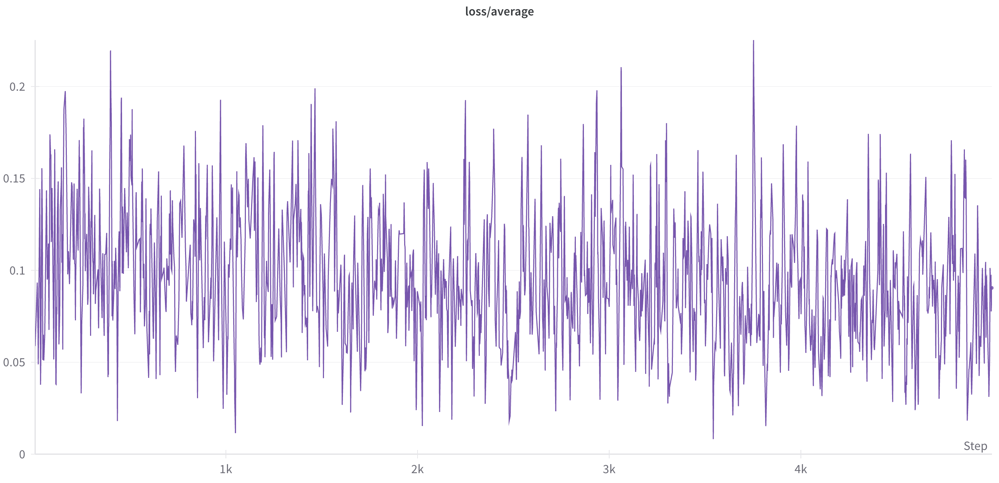
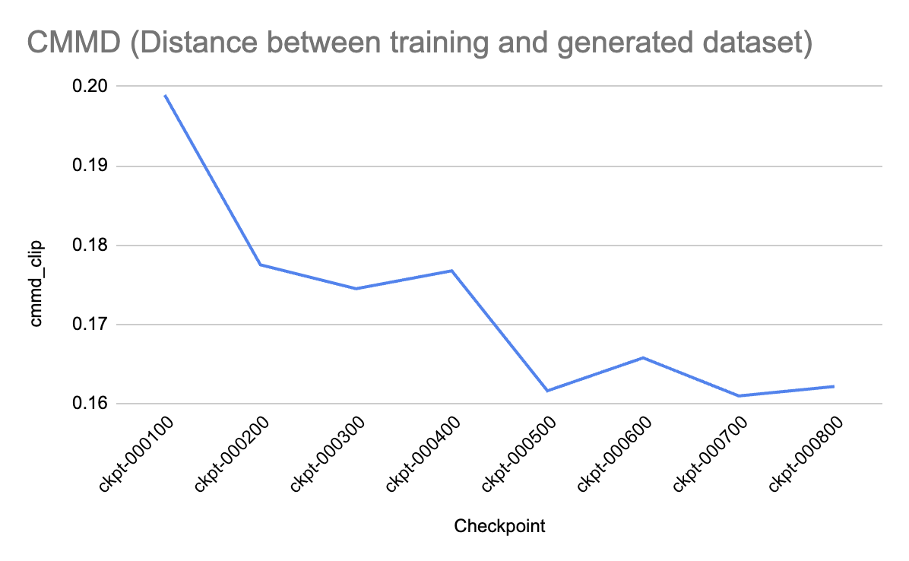

# Evaluation for Text-to-Image Models

## What is this?

**TL;DR**: A Python library providing utilities to evaluate text-to-image (T2I) models. It complements established benchmarks like [HEIM](https://crfm.stanford.edu/helm/heim/latest/) by focusing on metrics that help developers fine-tune T2I models for a particular style or concept.

Running it is as easy as:
```
pip install image-eval
image-eval -g <generated-dataset> -r <reference-dataset> -p <prompts-file> -m all
```
See the [installation section](#installation) for more detailed instructions.

## Motivation

Image quality is subjective, and evaluating text-to-image (T2I) models is hard. But we can't make progress without being able to *measure* progress. We need standardized and robust tooling.

Training T2I models is particularly difficult because there are no metrics to inform you whether your model is converging. For instance, this is what a typical training loss looks like:



The goal of this repo is to bring back measurability and help you make informed decisions when building T2I models. For instance, we discovered that using [CMMD](https://arxiv.org/abs/2312.05412) as a validation metric during training on as little as 50 images can help you gauge how much progress your model is making. The plot shows the distance between a reference set and the generated set for various checkpoints:



Read more about our discoveries in the [Tips and Tricks](#tips-and-tricks) section, which we will update as we learn more.

## Evaluation Metrics

### Categories
We use the following categories for our metrics, inspired by [LyCORIS](https://arxiv.org/abs/2309.14859):

1. **Fidelity**: the extent to which generated images adhere to the target concept.
2. **Pairwise similarity** between two images; in contrast, fidelity makes bulk comparisons between two datasets.
3. **Controllability**: the model’s ability to generate images that align well with text prompts.
4. **Diversity**: the variety of images that are produced from a single or a set of prompts.
5. **Image quality**: the visual appeal of the generated images (naturalness, absence of artifacts or deformations).

We dared to list these aspects in the order in which we believe they can be meaningfully measured. Measuring the *fidelity* of one dataset to another is a much better-defined problem than measuring a universal and elusive *image quality*.

### Metrics
Here are the metrics we currently support:

| Metric name | Category | Source |
|------------ | -------- | ----------- |
| `centroid_similarity` | fidelity | ours |
| `cmmd` | fidelity | [paper](https://arxiv.org/abs/2401.09603) |
| `lpips` | pairwise similarity | [paper](https://arxiv.org/pdf/1801.03924) |
| `multi_ssim` | pairwise similarity | [paper](https://ieeexplore.ieee.org/document/1292216) |
| `psnr` | pairwise similarity | [paper](https://ieeexplore.ieee.org/document/1163711) |
| `uiqui` | pairwise similarity | [paper](https://ieeexplore.ieee.org/document/1284395) |
| `clip_score` | controllability | [paper](https://arxiv.org/abs/2104.08718) |
| `image_reward` | controllability | [paper](https://arxiv.org/pdf/2304.05977.pdf) |
| `human_preference_score` | controllability | [repo](https://tgxs002.github.io/align_sd_web/) |
| `vendi_score` | diversity | [paper](https://arxiv.org/abs/2210.02410) |
| `fid` | image quality | [paper](https://arxiv.org/pdf/1706.08500) |
| `inception_score` | image quality | [paper](https://arxiv.org/abs/1606.03498) |
| `aesthetic_predictor` | image quality | [repo](https://github.com/christophschuhmann/improved-aesthetic-predictor) |

### Encoders
Some of the metrics above rely on image embeddings in a modular way -- even though they were originally published using CLIP embeddings, we noticed that swapping embeddings might lead to better metrics in certain cases. We allow you to mix and match the metrics above with the following:

1. **[CLIP](https://arxiv.org/abs/2103.00020)** is by far the most popular encoder. It was used by the original Stable Diffusion model.
2. **[DINOv2](https://arxiv.org/abs/2304.07193)**. Compared to CLIP, which used text-guided pretraining (aligning images against captions), DINOv2 used self-supervised learning on images alone. Its training objective maximizes agreement between different patches within the same image. It was trained on a dataset of 142M automatically curated images.
3. **[ConvNeXt V2](https://arxiv.org/abs/2301.00808)**. Similarly to DINOv2, ConvNeXt V2 did not use text-guided pretraining. It was trained on an image dataset to recover masked patches. In contrast to DINOv2 (which uses a ViT), ConvNeXt V2 uses a convolutional architecture. ConvNeXtV2 is the successor of [MAE](https://arxiv.org/abs/2111.06377) (Masked Auto Encoder) embeddings.
4. **[InsightFace](https://insightface.ai/)** is particularly good at encoding human faces, and is very effective when fine-tuning T2I models for headshots.

## GUI
We also provide a simple and ready-to-use [Streamlit](https://streamlit.io/) interface for performing human evaluation of model outputs on your local machine. We recommend to use this when the automated metrics are just not discriminative enough to help you decide betwen two checkpoints.


## <a name="installation"></a>Installation

This library has been tested on Python 3.10.9. To install:
```
pip install image-eval
```

Optionally, if you have a CUDA-enabled device, install the [version of PyTorch](https://pytorch.org/get-started/previous-versions/) that matches your CUDA version. For CUDA 11.3, that might look like:
```
pip install torch==1.12.1+cu113 torchvision==0.13.1+cu113 --extra-index-url https://download.pytorch.org/whl/cu113
```

## Usage

There are two ways to interact with the `image-eval` library: either through the CLI or through the API.

### CLI for automated evaluation

Once you installed the library, you can invoke it through the CLI on your terminal via `image_eval <flags>`. The full list of flags is in [eval.py](eval.py), but here are the most important ones:

- `-g` should point to a folder of generated images
- `-r` should point to a folder of reference images
- `-p` (needed for controllability metrics only) should point to a `.json` file that stores `image_filename: prompt` pairs, for instance:
```
{
    "image_1.jpg": "prompt for image 1",
    "image_2.jpg": "prompt for image 2",
    ...
}
```
- `-m` should specify the desired metrics; it can be `all`, a certain category (e.g. `fidelity`) or a specific metric (e.g `centroid_similarity`).

For example, to calculate the fidelity of a generated dataset to some reference images, you would run
```
image_eval -m fidelity -g /path/to/generated/images -r /path/to/reference/images
```
The result will look like this:
```
| Metric Name                     |    Value |
|---------------------------------+----------|
| centroid_similarity_clip        | 0.844501 |
| centroid_similarity_dino_v2     | 0.573843 |
| centroid_similarity_convnext_v2 | 0.606375 |
| centroid_similarity_insightface | 0.488649 |
| cmmd_clip                       | 0.162164 |
| cmmd_dino_v2                    | 0.1689   |
| cmmd_convnext_v2                | 0.187492 |
| cmmd_insightface                | 0.169578 |
```

### CLI for human evaluation

To launch the human evaluation interface, run:
```
image_eval --local-human-eval --model-predictions-json /path/to/model_comparisons.json
```
Here `model_comparisons.json` is a JSON file with the following format:
```
[
    {
        "model_1": "path to image 1 from model 1",
        "model_2": "path to image 1 from model 2",
        "prompt": "prompt for image 1"
    },
    {
        "model_1": "path to image 2 from model 1",
        "model_2": "path to image 2 from model 2",
        "prompt": "prompt for image 2"
    },
    ...
]
```

where `model_1` and `model_2` are the keys for the paths to image outputs for the respective models. Our library does expect the **keys to match these values exactly**.

An interface should launch in your browser at `http://localhost:8501`.

NOTE: When you click `Compute Model Wins` a local file named `scores.json` will be created in the directory from which you launched the CLI.

### Programmatic

You can also interact with the library through the API directly. For example, to invoke the `clip_score` metric, you could do the following:
```
from image_eval.evaluators import CLIPScoreEvaluator

evaluator = CLIPScoreEvaluator(device="cpu") # or "cuda" if you have a GPU-enabled device
images = [np.randint(0, 255, (224, 224, 3)) for _ in range(10)] # list of 10 random images
prompts = ["random prompt" * 10]
evaluator.evaluate(images, prompts)
```

## <a name="tips-and-tricks"></a>Tips and Tricks
In this section, we will share our tips on how to use existing metrics to bring some rigor to the art of fine-tuning T2I models. Please don't take anything as an absolute truth. If we knew things for sure, we would be writing a paper instead of a Github README. Suggestions and constructive feedback are more than welcome!

[TODO]

## Contributing

We welcome any and all contributions to this library, as well as discussions on how we can make the art of training T2I models more scientific.

To add a new **metric**, all you need to do is create a new class that inherits from the `BaseEvaluator` and implements the `evaluate` method. For examples of how our current metrics implement this contract, see `evaluators.py`.

To add a new **encoder**, simply implement the `BaseEncoder` interface (see `encoders.py`).

## Other Resources
Here are other notable resources for evaluating T2I models:
- [HEIM](https://crfm.stanford.edu/helm/heim/latest/)
- [T2I-Compbench](https://github.com/Karine-Huang/T2I-CompBench)
